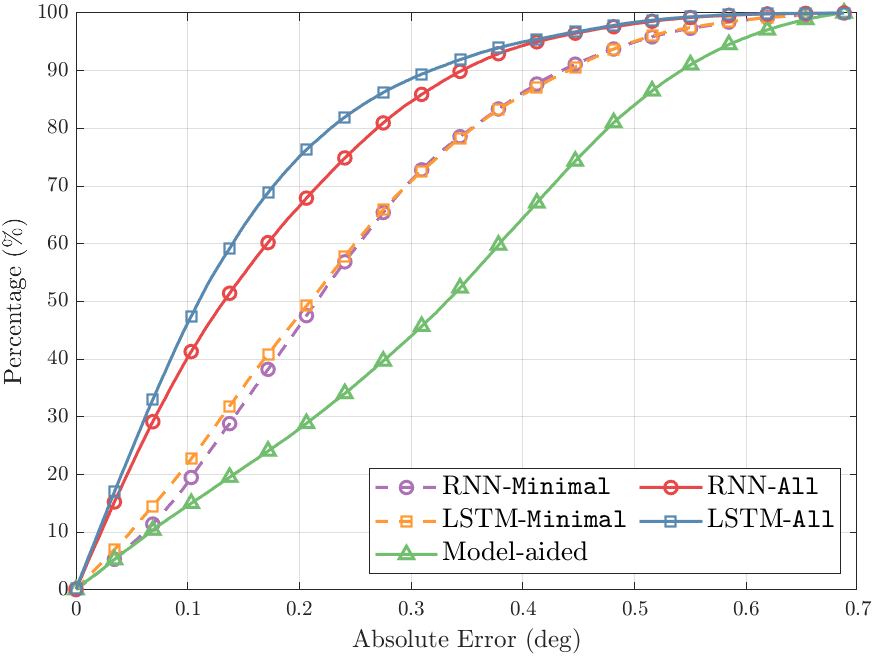

# paper_quality_plot.matlab

All materials are from [Urban Rotobitcs Lab.](http://urobot.kaist.ac.kr/) @KAIST

---

# Introduction

This repositoy contains 

* how to use linespecer for beautiful matlab graph

https://kr.mathworks.com/matlabcentral/fileexchange/42673-beautiful-and-distinguishable-line-colors-colormap

* how to set legend interpreter as latex

* tilelayout (Only applicable on latest version Matlab)

All outputs are located in `imgs` folder.

---

# Description

## Plot cdf

Note that the effect of the linespecer which is illustrated as: 

### Before linespecer

### After linespecer

**linespecer is more beautiful!** It allows the figures to be more clean and improves readability.

So, I strongly recommend utilizing `linespecer`!

Please refer to the line 7 to 9 in `plot_cdf.m`  :) 

## Plot pdf

## Plot 3D colormap trajectory

The trajectory is colored with respect to sequence length.

However, if the trajectory is too long, then it may be not applicable.

## Tilelayout

## Plot boxplots

## Line graph

