# paper_quality_plot.matlab

All materials are from [Urban Robotics Lab.](http://urobot.kaist.ac.kr/) @KAIST

Original author: Hyungtae Lim (shapelim@kaist.ac.kr)

Advisers: Giseop Kim (paulgkim@kaist.ac.kr), Byeongho YU (bhyu@kaist.ac.kr) 

**(01.09.25)** I have now given up on sticking solely to MATLAB. [SciencePlots](https://github.com/garrettj403/SciencePlots) is truly an excellent tool.

---

# Introduction

This repositoy contains 

* how to use linespecer for beautiful matlab graph

https://kr.mathworks.com/matlabcentral/fileexchange/42673-beautiful-and-distinguishable-line-colors-colormap

* how to set legend interpreter as latex

* the method for removing unnecessary white space

* the method for changing the default tick fonts to the latex version

* tilelayout (Only applicable on latest version Matlab)

* thousand seperator 

All outputs are located in `imgs` folder.

---
# Must be added for the Paper-quality Figures

:point_right: Add `set(gca,'LooseInset', max(get(gca,'TightInset'), 0.02))` below the figure declaration line.

:point_right: Add `set(groot, 'defaultAxesTickLabelInterpreter','latex');` below the figure declaration line.

:point_right: Add `ytickformat('%,4.4g');` after **plot( ) command** (optional).

The template is available on [here](template.m)

---

# When it comes to saving figures in eps...

ENG) I realized that some matlab figures (e.g., bar plot, tiles, or 3D plot) can not be saved in the vector format even though the file format is saved into `.eps`.

So, we must use below command as follows:

```
% gcf: figure object
% -r${NUM}: The larger, the higher resolution
print(gcf, "SET_YOUR_FINENAME.png",'-dpng','-r300'); 
```

KOR) Matlab에서 원래 eps로 저장하면 자동으로 그림이 vector format으로 변경되어야 하는데, 그렇지 않은 경우가 있습니다.

그럴 경우에는 아래와 같이 dpi를 조정하여 png로 논문에 넣을 수 밖에 없습니다.


```
% gcf: figure object
% -r${NUM}: The larger, the higher resolution
print(gcf, "SET_YOUR_FINENAME.png",'-dpng','-r300'); 
```


---

## Generated Figures

*Click on image titles to view the corresponding MATLAB script*

| Fgr Success Rate | Navigation Trajectory | Ransac10K Success Rate |
| :---: | :---: | :---: |
|  |  |  |
| FGR_success_rate | [Navigation_trajectory](plot_trajectory.m) | RANSAC10K_success_rate |

| Successrate1 Quatro Pp | Successrate2 Quatro Pp | Teaser Success Rate |
| :---: | :---: | :---: |
|  |  |  |
| SuccessRate1_quatro_pp | SuccessRate2_quatro_pp | TEASER_success_rate |

| Average Computational Time V2 I7 | Average Computational Time V2 I9 | Biou Horizontal Bar W Hrnet |
| :---: | :---: | :---: |
|  |  |  |
| average_computational_time_v2_i7 | average_computational_time_v2_i9 | [biou_horizontal_bar_w_hrnet](plot_barplot_avg_computation_time.m) |

| Biou Horizontal Bar W Hrnet | Biou Horizontal Bar W Hrnet 10Px | Biou Horizontal Bar W Hrnet 10Px |
| :---: | :---: | :---: |
|  |  | 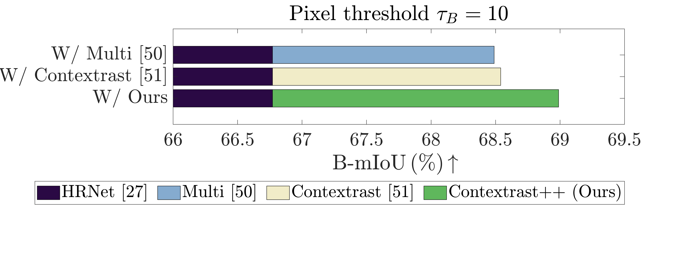 |
| [biou_horizontal_bar_w_hrnet](plot_barplot_avg_computation_time.m) | [biou_horizontal_bar_w_hrnet_10px](plot_barplot_avg_computation_time.m) | [biou_horizontal_bar_w_hrnet_10px](plot_barplot_avg_computation_time.m) |

| Biou Horizontal Bar W Hrnet 20Px | Biou Horizontal Bar W Hrnet 20Px | Biou Horizontal Bar W Hrnet 3Px |
| :---: | :---: | :---: |
|  | 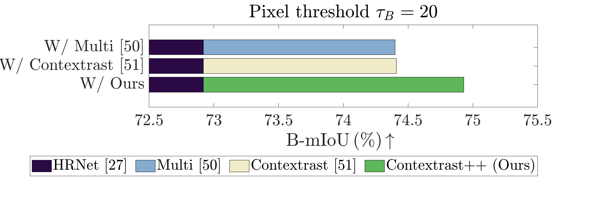 |  |
| [biou_horizontal_bar_w_hrnet_20px](plot_barplot_avg_computation_time.m) | [biou_horizontal_bar_w_hrnet_20px](plot_barplot_avg_computation_time.m) | [biou_horizontal_bar_w_hrnet_3px](plot_barplot_avg_computation_time.m) |

| Biou Horizontal Bar W Hrnet 3Px | Biou Horizontal Bar W Hrnet 7Px | Biou Horizontal Bar W Hrnet 7Px |
| :---: | :---: | :---: |
|  |  | 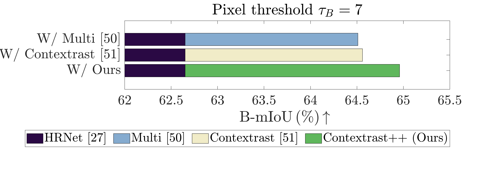 |
| [biou_horizontal_bar_w_hrnet_3px](plot_barplot_avg_computation_time.m) | [biou_horizontal_bar_w_hrnet_7px](plot_barplot_avg_computation_time.m) | [biou_horizontal_bar_w_hrnet_7px](plot_barplot_avg_computation_time.m) |

| Biou Line Graph | Biou Line Graph | Box Plot2 R300 |
| :---: | :---: | :---: |
|  |  |  |
| biou_line_graph | biou_line_graph | [box_plot2_r300](plot_boxplot2.m) |

| Boxplot1 | Boxplot2 | Campus Train0 Gt |
| :---: | :---: | :---: |
|  |  |  |
| [boxplot1](plot_boxplots.m) | [boxplot2](plot_boxplot2.m) | campus_train0_gt |

| Campus Train0 Gt | Campus Train1 Gt 2D | Campus Train1 Gt 2D |
| :---: | :---: | :---: |
| 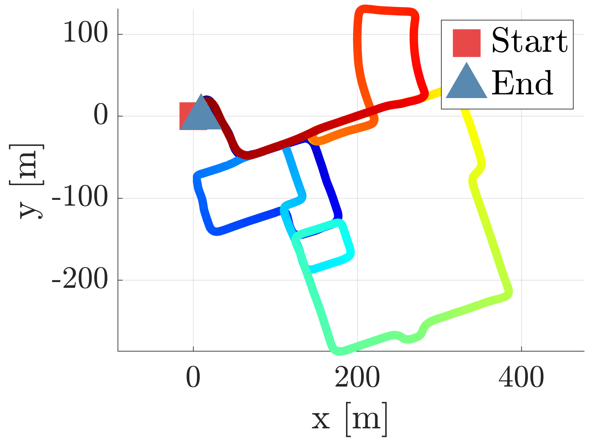 |  |  |
| campus_train0_gt | campus_train1_gt_2D | campus_train1_gt_2D |

| Caros Orientation | Caros Pitch Alpha | Caros Position |
| :---: | :---: | :---: |
| 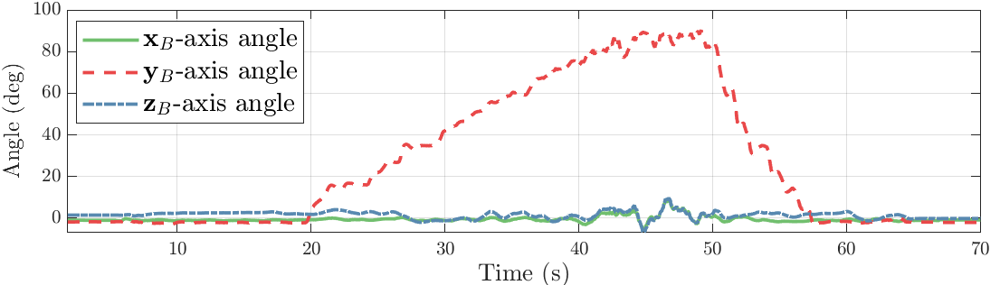 | 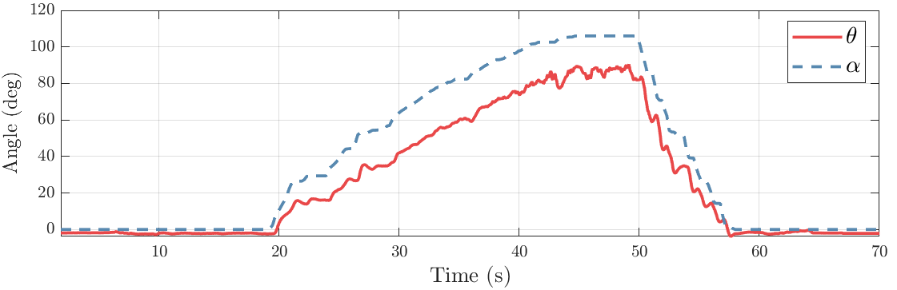 | 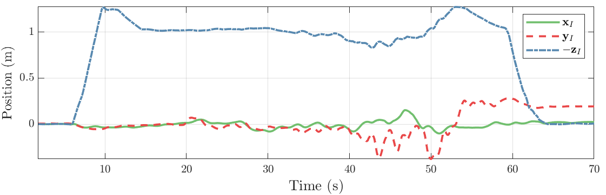 |
| [caros_orientation](plot_linegraph1.m) | [caros_pitch_alpha](plot_linegraph1.m) | [caros_position](plot_linegraph1.m) |

| Caros Rotor Speed | Caros Tile Output | Cdf For Chamfer Distance |
| :---: | :---: | :---: |
|  |  |  |
| [caros_rotor_speed](plot_linegraph1.m) | [caros_tile_output](plot_linegraph6.m) | [cdf_for_chamfer_distance](plot_cdf2.m) |

| Cdf For Chamfer Distance | Cdf For Chamfer Distance Class13 | Cdf For Chamfer Distance Class13 |
| :---: | :---: | :---: |
|  |  |  |
| [cdf_for_chamfer_distance](plot_cdf2.m) | [cdf_for_chamfer_distance_class13](plot_cdf2.m) | [cdf_for_chamfer_distance_class13](plot_cdf2.m) |

| Cdf For Chamfer Distance Class18 | Cdf For Chamfer Distance Class18 | Cdf For Chamfer Distance Class5 |
| :---: | :---: | :---: |
|  |  |  |
| [cdf_for_chamfer_distance_class18](plot_cdf2.m) | [cdf_for_chamfer_distance_class18](plot_cdf2.m) | [cdf_for_chamfer_distance_class5](plot_cdf2.m) |

| Cdf For Chamfer Distance Class5 | Cdf For Chamfer Distance Class7 | Cdf For Chamfer Distance Class7 |
| :---: | :---: | :---: |
|  |  |  |
| [cdf_for_chamfer_distance_class5](plot_cdf2.m) | [cdf_for_chamfer_distance_class7](plot_cdf2.m) | [cdf_for_chamfer_distance_class7](plot_cdf2.m) |

| Ciampino Train0 Gt | Ciampino Train0 Gt | Ciampino Train0 Gt 2D |
| :---: | :---: | :---: |
|  |  |  |
| ciampino_train0_gt | ciampino_train0_gt | ciampino_train0_gt_2D |

| Ciampino Train0 Gt 2D | Ciampino Train1 Gt | Ciampino Train1 Gt |
| :---: | :---: | :---: |
|  |  |  |
| ciampino_train0_gt_2D | ciampino_train1_gt | ciampino_train1_gt |

| Ciampino Train1 Gt 2D | Ciampino Train1 Gt 2D | Colosseo Train0 Gt |
| :---: | :---: | :---: |
|  |  |  |
| ciampino_train1_gt_2D | ciampino_train1_gt_2D | colosseo_train0_gt |

| Colosseo Train0 Gt | Colosseo Train0 Gt 2D | Colosseo Train0 Gt 2D |
| :---: | :---: | :---: |
|  |  | 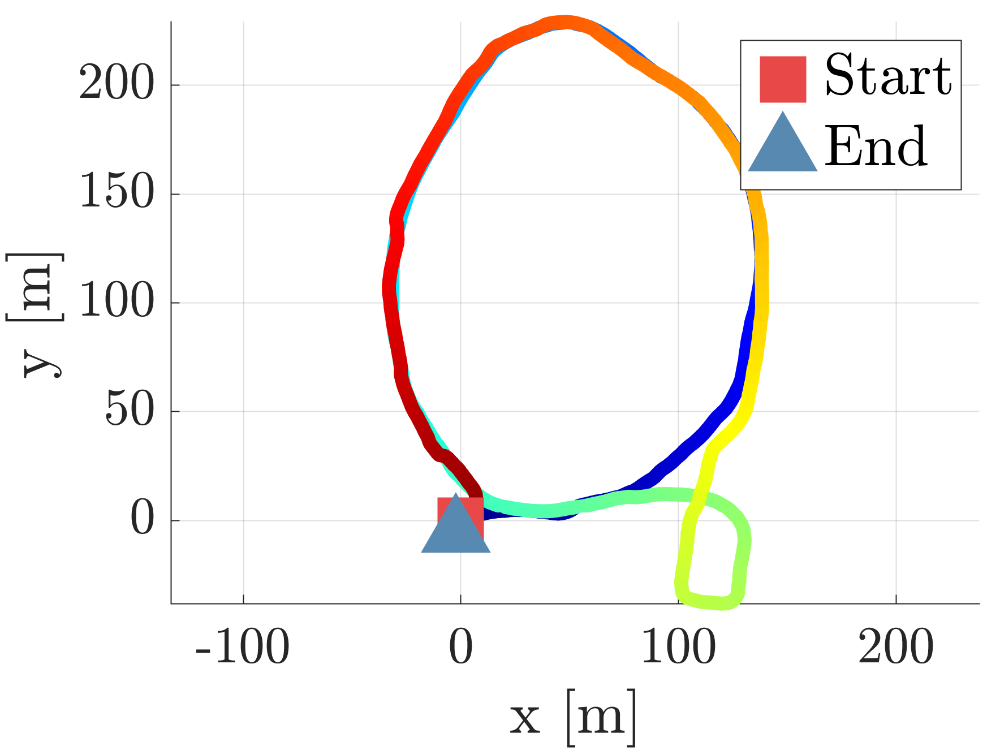 |
| colosseo_train0_gt | colosseo_train0_gt_2D | colosseo_train0_gt_2D |

| Diag Train0 Gt | Diag Train0 Gt | Diag Train0 Gt 2D |
| :---: | :---: | :---: |
|  |  |  |
| diag_train0_gt | diag_train0_gt | diag_train0_gt_2D |

| Diag Train0 Gt 2D | Erasor Ground Percentage | Erasor Ground Preservation |
| :---: | :---: | :---: |
| 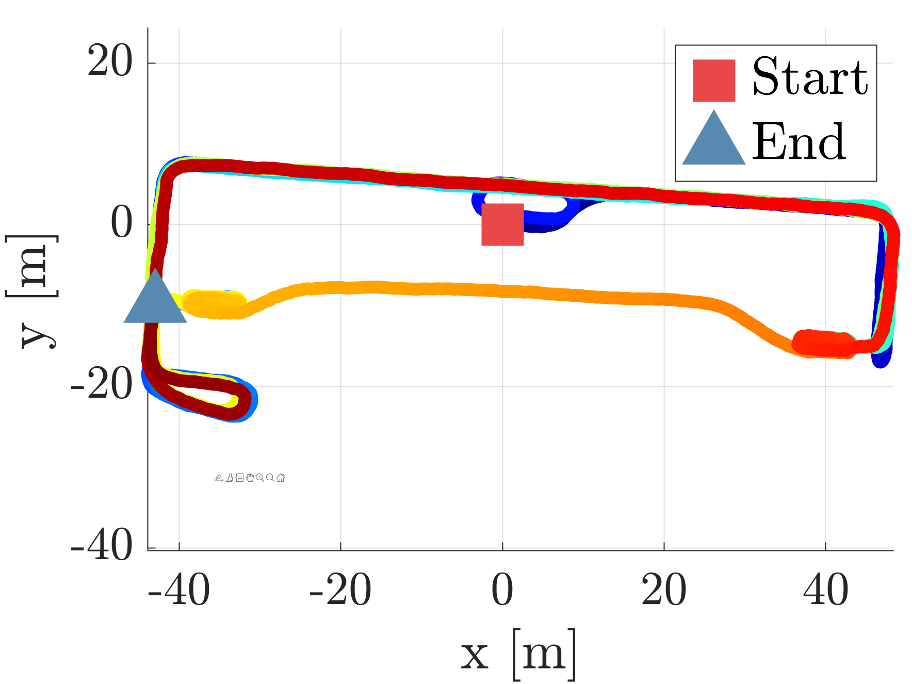 |  |  |
| diag_train0_gt_2D | [erasor_ground_percentage](plot_linegraph2.m) | [erasor_ground_preservation](plot_linegraph6.m) |

| Erasor Ground Rejection | Erasor Ground Rel | Erasor Pdf Diff Percentage |
| :---: | :---: | :---: |
|  | 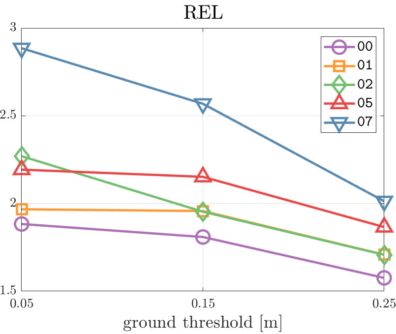 | 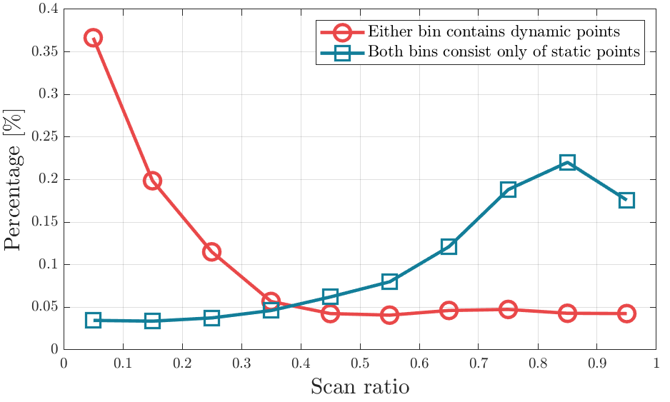 |
| [erasor_ground_rejection](plot_linegraph2.m) | [erasor_ground_rel](plot_linegraph6.m) | [erasor_pdf_diff_percentage](plot_pdf.m) |

| F1 Vs Threshold | F1 Vs Threshold | Final Tilelayout |
| :---: | :---: | :---: |
|  |  |  |
| f1_vs_threshold | f1_vs_threshold | [final_tilelayout](plot_tilelayout.m) |

| Ground Bar Plot V2 | Ground Bar Plot V2 | Horizontal Bar W Deeplabv3 |
| :---: | :---: | :---: |
|  |  |  |
| [ground_bar_plot_v2](plot_barplot.m) | [ground_bar_plot_v2](plot_barplot.m) | [horizontal_bar_w_deeplabv3](plot_barplot_avg_computation_time.m) |

| Horizontal Bar W Deeplabv3 | Horizontal Bar W Hrnet | Horizontal Bar W Hrnet |
| :---: | :---: | :---: |
| 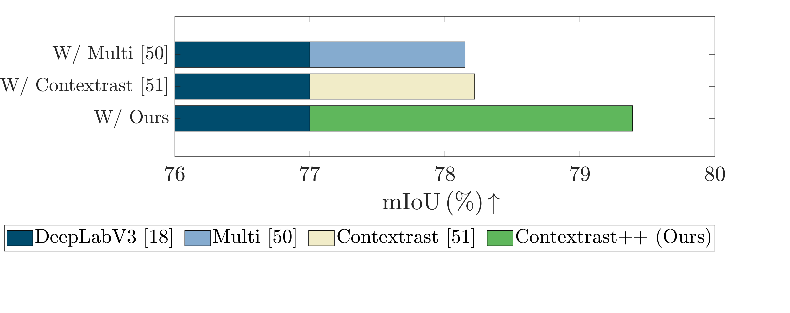 |  |  |
| [horizontal_bar_w_deeplabv3](plot_barplot_avg_computation_time.m) | [horizontal_bar_w_hrnet](plot_barplot_avg_computation_time.m) | [horizontal_bar_w_hrnet](plot_barplot_avg_computation_time.m) |

| Horizontal Bar W Ocrnet | Horizontal Bar W Ocrnet | Horizontal Bar W Upernet |
| :---: | :---: | :---: |
|  | 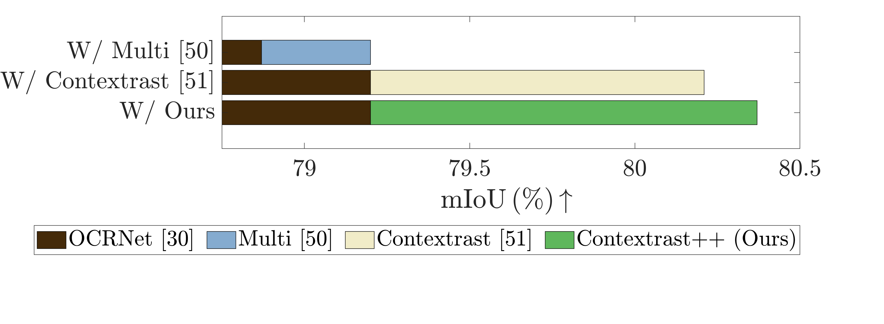 |  |
| [horizontal_bar_w_ocrnet](plot_barplot_avg_computation_time.m) | [horizontal_bar_w_ocrnet](plot_barplot_avg_computation_time.m) | [horizontal_bar_w_upernet](plot_barplot_avg_computation_time.m) |

| Horizontal Bar W Upernet | Hydra2 0 F1 | Hydra2 0 F1 |
| :---: | :---: | :---: |
| 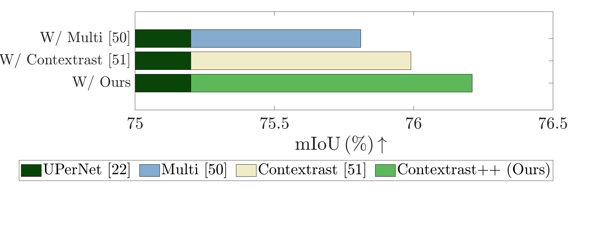 |  |  |
| [horizontal_bar_w_upernet](plot_barplot_avg_computation_time.m) | hydra2_0_f1 | hydra2_0_f1 |

| Hydra2 0 Precision | Hydra2 0 Precision | Hydra2 0 Recall |
| :---: | :---: | :---: |
|  |  |  |
| hydra2_0_precision | hydra2_0_precision | hydra2_0_recall |

| Hydra2 0 Recall | Num Mc | Num Rot Inlier |
| :---: | :---: | :---: |
|  |  |  |
| hydra2_0_recall | num_MC | num_rot_inlier |

| Num Trans Inlier | Pincio Train0 Gt | Pincio Train0 Gt |
| :---: | :---: | :---: |
|  |  |  |
| num_trans_inlier | pincio_train0_gt | pincio_train0_gt |

| Pincio Train0 Gt 2D | Pincio Train0 Gt 2D | Precision Recall Curve |
| :---: | :---: | :---: |
|  |  |  |
| pincio_train0_gt_2D | pincio_train0_gt_2D | precision_recall_curve |

| Precision Recall Curve | Spagna Train0 Gt | Spagna Train0 Gt |
| :---: | :---: | :---: |
|  |  |  |
| precision_recall_curve | spagna_train0_gt | spagna_train0_gt |

| Spagna Train0 Gt 2D | Spagna Train0 Gt 2D | Template |
| :---: | :---: | :---: |
|  | 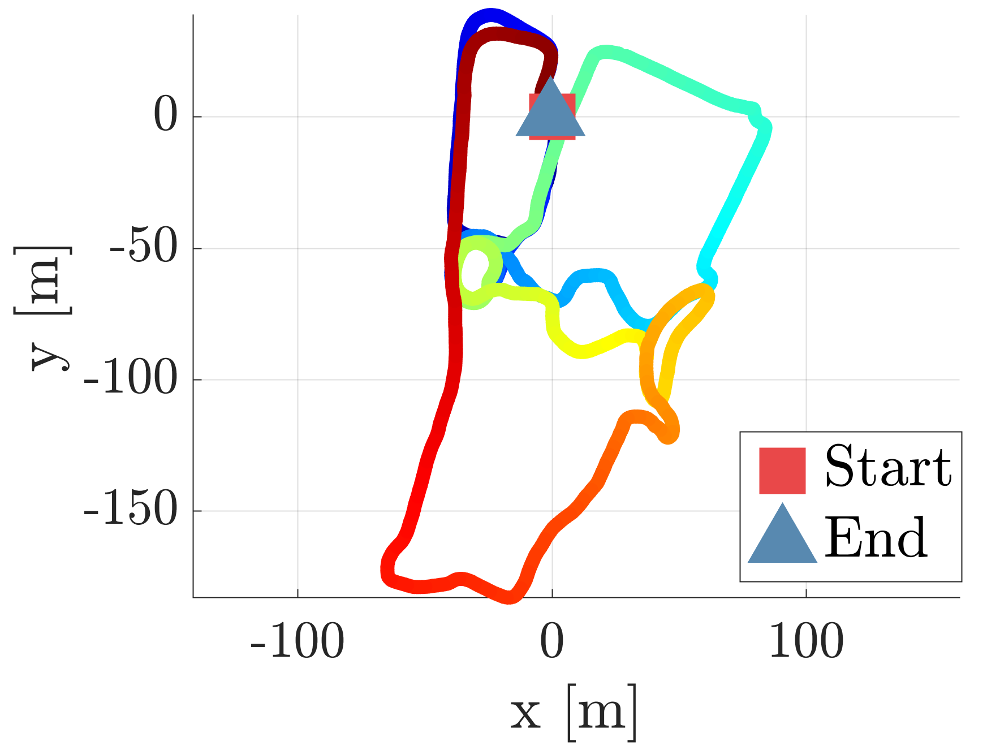 |  |
| spagna_train0_gt_2D | spagna_train0_gt_2D | template |

| Time Stacked | Time Stacked | Tims Rotation V30 |
| :---: | :---: | :---: |
|  |  |  |
| [time_stacked](plot_time_stacked.m) | [time_stacked](plot_time_stacked.m) | [tims_rotation_v30](plot_scatter_w_heatmap.m) |

| Total Cdf Alpha | Total Cdf Alpha | Total Cdf Beta |
| :---: | :---: | :---: |
|  |  |  |
| [total_cdf_alpha](plot_cdf.m) | [total_cdf_alpha](plot_cdf.m) | [total_cdf_beta](plot_cdf.m) |

| Vggt Accuracy | Vggt Accuracy | Vggt Ate |
| :---: | :---: | :---: |
|  |  |  |
| vggt_accuracy | vggt_accuracy | vggt_ate |

| Vggt Ate | Vggt Chamfer | Vggt Chamfer |
| :---: | :---: | :---: |
|  |  |  |
| vggt_ate | vggt_chamfer | vggt_chamfer |

| Vggt Completion | Vggt Completion |  |
| :---: | :---: |  |
|  |  |  |
| vggt_completion | vggt_completion |  |

# Description

## [Plot cdf](plot_cdf.m)

Note that the effect of the linespecer which is illustrated as: 

### Before using linespecer


### After using linespecer


**linespecer is more beautiful!** It allows the figures to be more clean and improves readability.

So, I strongly recommend utilizing `linespecer`!

Please refer to the line 7 to 9 and 124 to 133 in `plot_cdf.m`  :) 

## [Plot pdf](plot_pdf.m)


Note that the built-in pdf function of matlab does not work sometimes. My method is better!

## [Plot 3D colormap trajectory](plot_trajectory.m)


The trajectory is colored with respect to sequence length.

However, if the trajectory is too long, then it may be not applicable.

## [Plot scatter w/ heatmap](plot_scatter_w_heatmap.m)


## [Line graph1](plot_linegraph1.m)


## [Line graph2](plot_linegraph2.m)


## [Plot boxplots (improved)](plot_boxplot2.m)

Note that [multiple_boxplot_time.m](multiple_boxplot_time.m) function is required


## [Plot boxplots](plot_boxplots.m)


**ToDo.** Set the fonts of ticks as Times New Roman

## [Plot barplot](plot_barplot.m)

Only available on **R2020a**.


## [Tilelayout](plot_tilelayout.m)

Only available on **R2020a**.

**ToDo.** Set the fonts of ticks as Times New Roman


## [Stacked time plot](plot_time_stacked.m)


