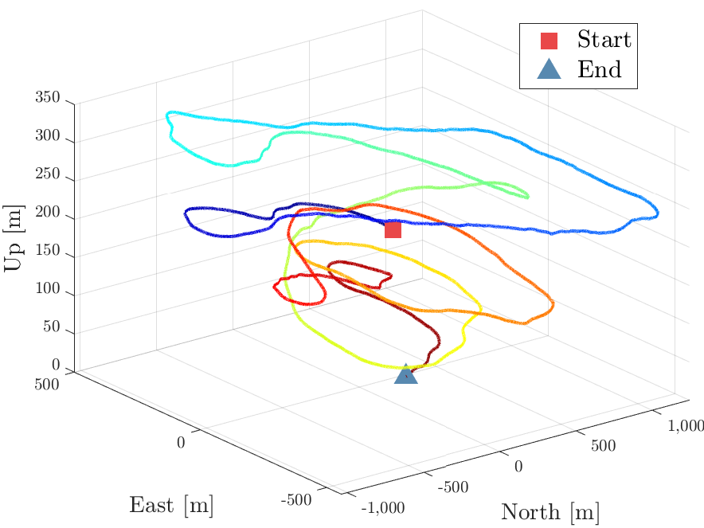
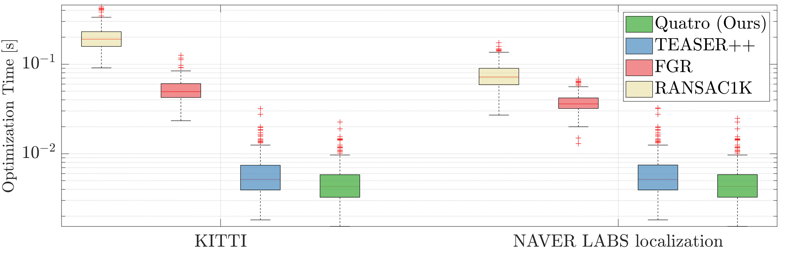
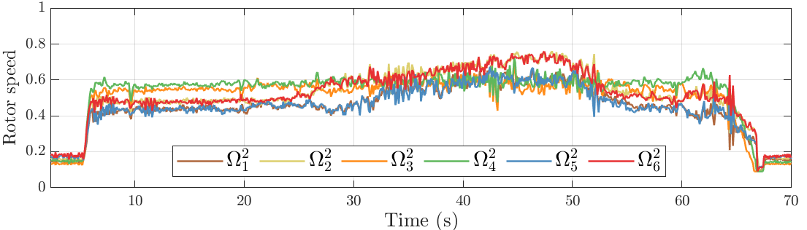
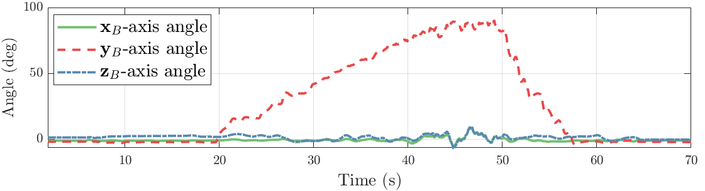

<div align="center">
    <h1>Paper Quality Plot for MATLAB</h1>
    <a href="https://www.mathworks.com/products/matlab.html"></a>
    <!-- <a href="http://urobot.kaist.ac.kr/"></a> -->
    <br />
    <br />
    <p><strong><em>Create publication-ready figures with beautiful MATLAB visualizations.</em></strong></p>
    <br />
</div>

---

## ✨ Sample Gallery

<div align="center">
    <table>
        <tr>
            <td align="center">
                
                <br/><b>CDF Visualization</b>
            </td>
            <td align="center">
                
                <br/><b>3D Trajectory</b>
            </td>
            <td align="center">
                
                <br/><b>Scatter w/ Heatmap</b>
            </td>
        </tr>
        <tr>
            <td align="center">
                
                <br/><b>Advanced Boxplot</b>
            </td>
            <td align="center">
                
                <br/><b>Publication Bar Plot</b>
            </td>
            <td align="center">
                
                <br/><b>Tile Layout</b>
            </td>
        </tr>
        <tr>
            <td align="center">
                
                <br/><b>PDF Visualization</b>
            </td>
            <td align="center">
                
                <br/><b>Line Graph</b>
            </td>
            <td align="center">
                
                <br/><b>Stacked Time Plot</b>
            </td>
        </tr>
    </table>
</div>

---

## 📋 Introduction

**(01.09.25)** I have now given up on sticking solely to MATLAB. [SciencePlots](https://github.com/garrettj403/SciencePlots) is truly an excellent tool.

This repository contains essential tools and techniques for creating **publication-quality figures** in MATLAB:

* 🎨 **LineSpecer** for beautiful and distinguishable line colors ([FileExchange](https://kr.mathworks.com/matlabcentral/fileexchange/42673-beautiful-and-distinguishable-line-colors-colormap))
* 📝 **LaTeX interpreter** for legends and labels
* 🔧 **White space removal** methods
* 🔤 **LaTeX fonts** for tick labels
* 📐 **TileLayout** functionality (MATLAB R2020a+)
* 🔢 **Thousand separator** formatting

All output examples are located in the `imgs` folder.

---
# Must be added for the Paper-quality Figures

:point_right: Add `set(gca,'LooseInset', max(get(gca,'TightInset'), 0.02))` below the figure declaration line.

:point_right: Add `set(groot, 'defaultAxesTickLabelInterpreter','latex');` below the figure declaration line.

:point_right: Add `ytickformat('%,4.4g');` after **plot( ) command** (optional).

The template is available on [here](template.m)

---

# When it comes to saving figures in eps...

ENG) I realized that some matlab figures (e.g., bar plot, tiles, or 3D plot) can not be saved in the vector format even though the file format is saved into `.eps`.

So, we must use below command as follows:

```
% gcf: figure object
% -r${NUM}: The larger, the higher resolution
print(gcf, "SET_YOUR_FINENAME.png",'-dpng','-r300'); 
```

KOR) Matlab에서 원래 eps로 저장하면 자동으로 그림이 vector format으로 변경되어야 하는데, 그렇지 않은 경우가 있습니다.

그럴 경우에는 아래와 같이 dpi를 조정하여 png로 논문에 넣을 수 밖에 없습니다.


```
% gcf: figure object
% -r${NUM}: The larger, the higher resolution
print(gcf, "SET_YOUR_FINENAME.png",'-dpng','-r300'); 
```


---

## Generated Figures

*Click on image titles to view the corresponding MATLAB script*

# Description

## [Plot cdf](plot_cdf.m)

Note that the effect of the linespecer which is illustrated as: 

### Before using linespecer


### After using linespecer


**linespecer is more beautiful!** It allows the figures to be more clean and improves readability.

So, I strongly recommend utilizing `linespecer`!

Please refer to the line 7 to 9 and 124 to 133 in `plot_cdf.m`  :) 

## [Plot pdf](plot_pdf.m)


Note that the built-in pdf function of matlab does not work sometimes. My method is better!

## [Plot 3D colormap trajectory](plot_trajectory.m)


The trajectory is colored with respect to sequence length.

However, if the trajectory is too long, then it may be not applicable.

## [Plot scatter w/ heatmap](plot_scatter_w_heatmap.m)


## [Line graph1](plot_linegraph1.m)





## [Line graph2](plot_linegraph2.m)


## [Plot boxplots (improved)](plot_boxplot2.m)

Note that [multiple_boxplot_time.m](multiple_boxplot_time.m) function is required


## [Plot boxplots](plot_boxplots.m)


**ToDo.** Set the fonts of ticks as Times New Roman

## [Plot barplot](plot_barplot.m)

Only available on **R2020a**.


## [Tilelayout](plot_tilelayout.m)

Only available on **R2020a**.

**ToDo.** Set the fonts of ticks as Times New Roman


## [Stacked time plot](plot_time_stacked.m)


